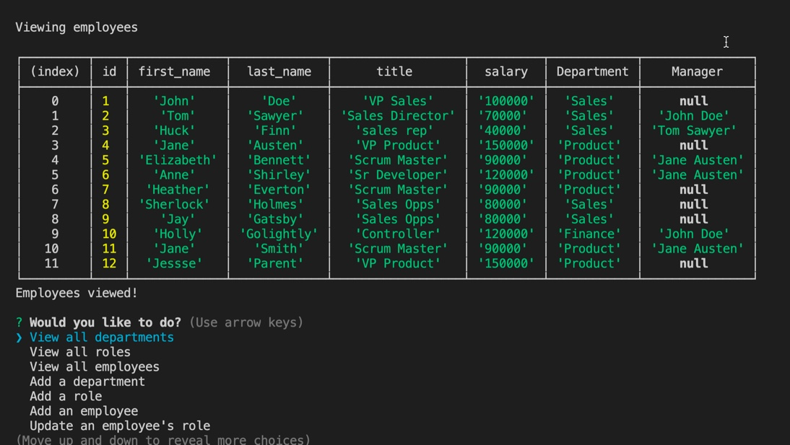

# Employee-Tracker

## Description
This is a simple  application that allows users to manage thier Team's employeement information in a mysql database. 



<a href="https://github.com/heather-everton/Employee-Tracker"><strong>Explore the docs »</strong></a>
<br />
<a href="https://drive.google.com/file/d/1H72uJqr_1qX_Yw5dDLaHuB-ZRxrRip43/view">View Demo</a>

## Table of Contents
* [Installation](#installation)
* [Usage](#usage)
* [Contributing](#contributing)
* [Questions](#questions)


## Installation
To install necessary dependencies, run the following command:
```
mysql2 install
npm install
npm install inquirer
```
## Usage
    This will allow user to run inquirer to manage their team's basic employement information. Use "npm start" to run the application. 

## Contributing
If you're interested in contributing please reach out to me via email. 

## Questions
If you have any questions about the repo, open an issue or contact me directly at heathereverton88@gmail.com. You can find more of my work at (https://github.com/heather-everton/).

### Built With
* [npm](https://www.npmjs.com/)
* [mysql](https://www.mysql.com/)


## Roadmap

See the [open issues](https://github.com/heather-everton/Employee-Tracker/issues) for a list of proposed features (and known issues).